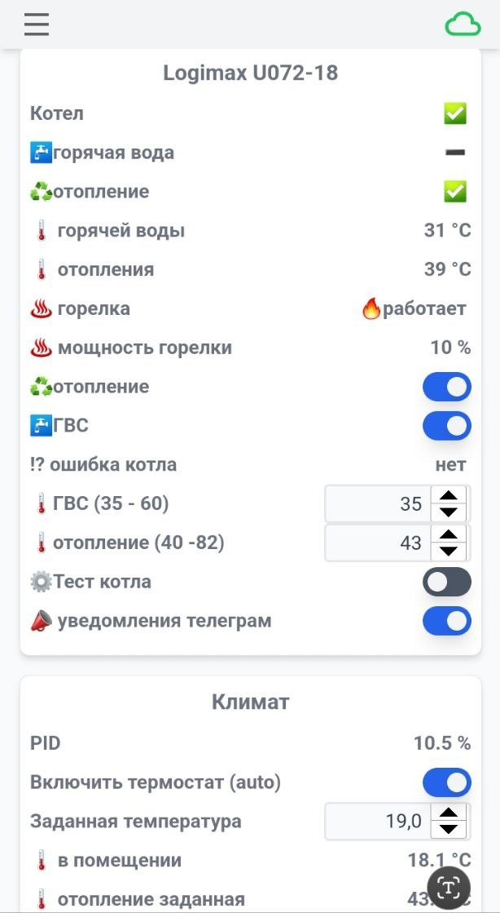
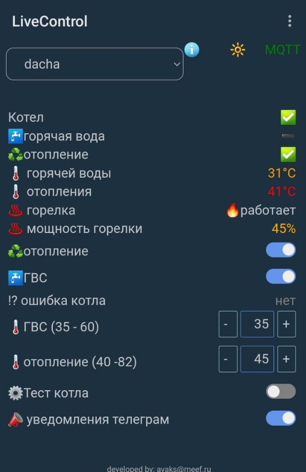
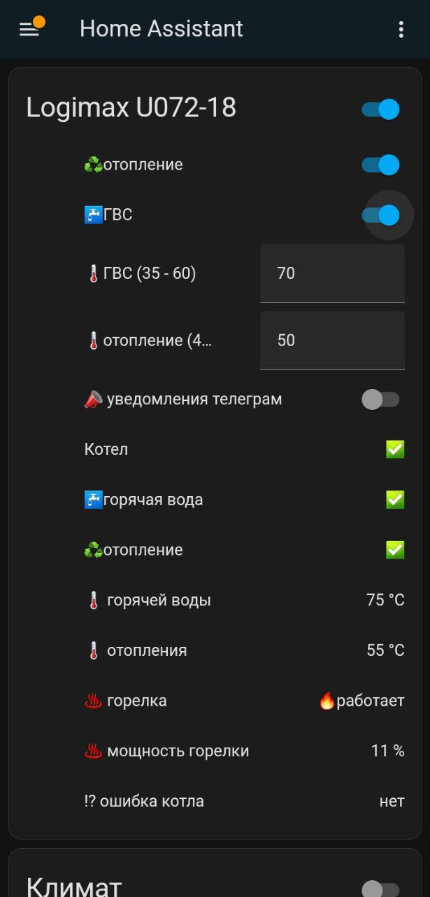
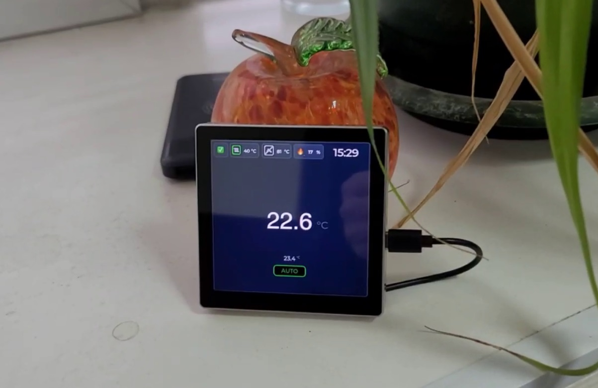
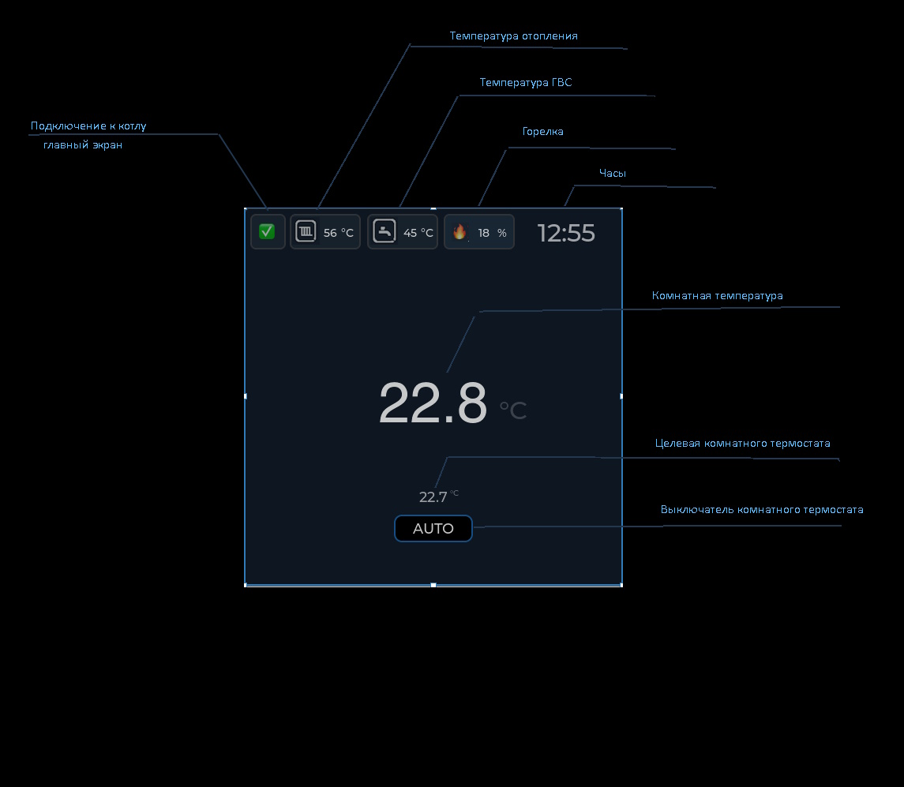

# 🔥 IoTManager - OpenTherm Controller

> OpenTherm контроллер отопительного котла.  
> Мониторинг состояния котла и управление термостатированием.

---

## 🚀 Возможности

### 🖥️ Web-интерфейс контроллера

Встроенный веб-интерфейс позволяет:
- 📊 **Мониторинг** — отслеживание всех параметров котла в реальном времени
- 🎛️ **Управление** — изменение температуры, режимов работы
- 📈 **Графики** — построение графикв по любым параметрам
- 🔍 **Диагностика** — чтение любых команд протокола OpenTherm

### 📱 Мобильное приложение

Управление через мобильное приложение IoT Manager (iOS/Android).

### 🏠 Интеграция с Home Assistant

Полная поддержка MQTT для интеграции с Home Assistant.

---

## 🌡️ Встроенный термостат

Реализованы **4 варианта термостатирования**:

| Режим | Описание |
|-------|----------|
| 🔄 **PID** | Управление температурой в контуре отопления |
| 📊 **Гистерезис** | Включение при отклонении температуры от заданной |
| 📉 **Эквитермические кривые** | Регулировка по температуре на улице |
| 🌡️ **Эквитермические + помещение** | То же + учёт температуры в помещении |

---

## 📋 Требования

| Компонент | Описание |
|-----------|----------|
| **Адаптер OpenTherm** | С ESP32-С6 (рекомендуется) или ESP32 |
| **MQTT брокер** | Локальный (Mosquitto) или облачный |
| **Wi-Fi роутер** | Для локального управления |

---

## 🖥️ OTPanel — Панель управления

Дистанционная панель для управления контроллром OpenTherm. Не требует проводов!

### Поддерживаемые контроллеры

- ✅ SmartTherm
- ✅ OTGateway
- ✅ Live-Control
- ✅ SmartKot Wi-Fi
- ✅ SmartKot ZigBee (zigbee2mqtt, HOMEd)

### Возможности панели

- 🎯 Изменение целевой температуры термостата
- 🔌 Включение/выключение термостата
- 🚿 Управление контуром отопления и ГВС

### Элементы панели

### Где купить

Панель **ESP32-4848S040C** (ESP32 LVGL) доступна на AliExpress:
- [Без блока питания](https://aliexpress.com/item/ESP32-4848S040C) — крепится на липучки, питание 5V
- [С блоком питания и реле](https://aliexpress.com/item/ESP32-4848S040C-power) — в квадратный подрозетник, 3 реле 10A

## 📚 Документация и поддержка

| Ресурс | Ссылка |
|--------|--------|
| 💬 **Telegram канал** | [@live_control](https://t.me/live_control) |
| 🌐 **Wiki** | [live-control.com](https://live-control.com/wiki/) |